# UIAutomator Desktop — Tutoriel complet

> Application desktop (Compose Multiplatform / JVM) d'inspection et d'exploration
> d'applications Android via ADB : capture d'écran + arbre UI, exploration
> manuelle pilotée, exploration automatique avec règles personnalisées,
> visualisation en graphe, gestion de sessions.

---

## Sommaire

1. [Premier lancement et configuration](#1-premier-lancement-et-configuration)
2. [La capture simple (écran principal)](#2-la-capture-simple-écran-principal)
3. [Le mode d'exploration manuelle](#3-le-mode-dexploration-manuelle)
4. [Le mode d'exploration automatique](#4-le-mode-dexploration-automatique)
5. [Les règles personnalisées](#5-les-règles-personnalisées)
6. [Le graphe d'exploration](#6-le-graphe-dexploration)
7. [La gestion des sessions](#7-la-gestion-des-sessions)
8. [Les paramètres](#8-les-paramètres)
9. [Astuces et raccourcis transverses](#9-astuces-et-raccourcis-transverses)

---

## 1. Premier lancement et configuration

Lancez l'application :

```shell
# Windows
.\gradlew.bat :composeApp:run
# macOS / Linux
./gradlew :composeApp:run
```

Au premier lancement, l'application tente une **autodétection d'ADB** : elle
cherche l'exécutable dans `ANDROID_HOME` / `ANDROID_SDK_ROOT`, dans les
emplacements standards du SDK (`%LOCALAPPDATA%\Android\Sdk` sous Windows,
`~/Library/Android/sdk` sous macOS, `~/Android/Sdk` sous Linux…) puis dans le
`PATH`. Si elle échoue, rendez-vous dans **Settings** pour renseigner le chemin
manuellement (voir [§8](#8-les-paramètres)).

Branchez ensuite un appareil Android (ou démarrez un émulateur) avec le
**débogage USB activé**, puis cliquez sur **Actualiser devices** dans la barre
d'outils et choisissez votre appareil dans la liste déroulante. L'appareil
choisi est mémorisé d'un lancement à l'autre.

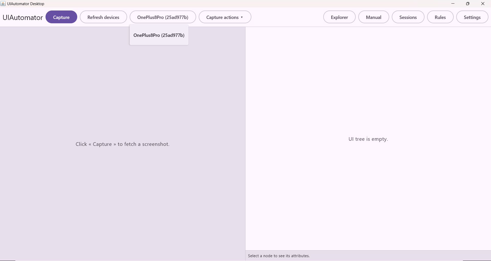

---

## 2. La capture simple (écran principal)

C'est l'équivalent du `uiautomatorviewer` de base : une photo de l'écran du device et l'arbre d'accessibilité correspondant, côte à côte et synchronisés.

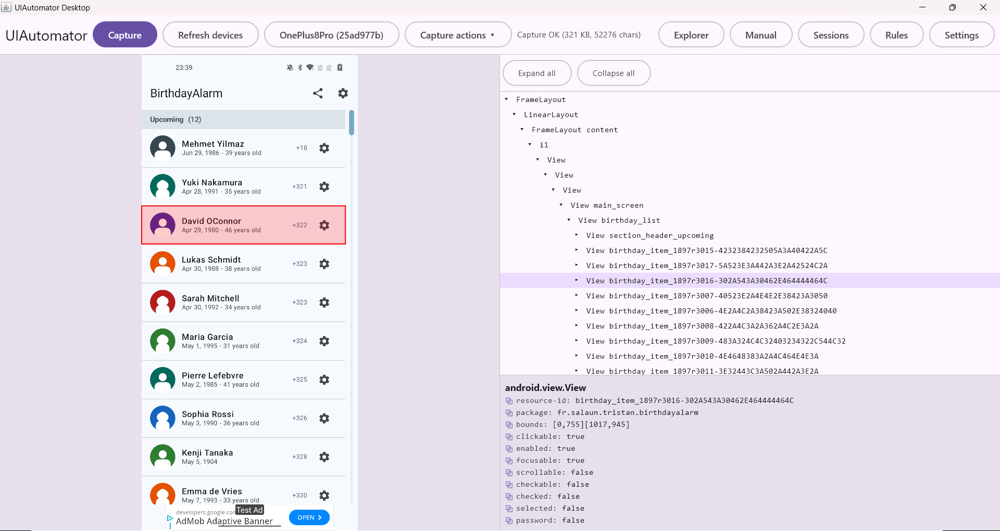


### 2.1 La barre d'outils

| Élément | Rôle |
|---|---|
| **Capturer** | Prend un screenshot PNG **et** un dump XML de l'écran courant du device. Désactivé tant qu'ADB n'est pas configuré ou qu'aucun device n'est choisi. |
| **Actualiser devices** | Re-scanne les appareils connectés (`adb devices`). |
| **Liste déroulante device** | Choix de l'appareil cible ; mémorisé dans les préférences. |
| **Actions sur la capture ▾** | Menu : Exporter…, Importer…, Copier l'image, Copier le XML, Enregistrer l'image…, Enregistrer le XML… |
| **Explorer / Manuel / Sessions / Règles / Graphe / Paramètres** | Navigation vers les autres écrans. *Graphe* n'apparaît que lorsqu'une session est chargée. |

Un *spinner* apparaît à côté des boutons pendant toute opération ADB, et la
zone de droite affiche le dernier message de statut (taille de la capture…)
ou d'erreur (en rouge).

### 2.2 Import / export d'une capture

- **Exporter…** crée une archive `capture.zip` contenant exactement
  `screenshot.png` + `dump.xml`. C'est le format d'échange : vous pouvez
  l'envoyer à un collègue qui n'a pas le device.
- **Importer…** recharge une telle archive — l'écran se comporte ensuite
  exactement comme après une capture live (arbre navigable, sélection…).
- **Copier l'image / Copier le XML** placent la capture dans le presse-papier
  (image AWT / texte brut).
- **Enregistrer l'image… / Enregistrer le XML…** écrivent les fichiers bruts
  où vous voulez.

### 2.3 Le panneau screenshot (gauche)

- **Survol** : l'élément UI le plus petit sous le curseur est surligné en
  **rouge** en temps réel, et la ligne correspondante de l'arbre XML est mise
  en évidence (avec dépliage automatique de ses ancêtres et auto-scroll).
- **Clic** : **verrouille la sélection** (« épinglage »). Le survol ne change
  plus la sélection : vous pouvez déplacer la souris vers l'arbre pour
  examiner l'élément sans le perdre. Sortir du panneau libère le verrou.

### 2.4 Le panneau arbre XML (droite)

- **Tout déplier / Tout replier** : expansion globale de l'arbre.
- **Chevron ▸ / ▾** : déplie / replie un nœud.
- **Survol d'une ligne** : surligne l'élément sur le screenshot (rouge).
- **Clic sur une ligne** : sélectionne **et épingle** le nœud (le survol ne
  change plus la sélection), et donne le focus clavier à l'arbre.
- **Double-clic sur une ligne** : dépliage / repliage **profond** — tout le
  sous-arbre d'un coup.
- **Navigation clavier** (après un clic) : `↑` / `↓` parcourent les lignes
  visibles, `→` déplie le nœud courant, `←` le replie. La sélection reste
  toujours visible (auto-scroll animé).

### 2.5 Le panneau de détails (bas droite)

Tous les attributs du nœud sélectionné : classe, `resource-id`, `text`,
`content-desc`, `package`, `bounds`, et les drapeaux (`clickable`, `enabled`,
`focusable`, `scrollable`, `checkable`, `checked`, `selected`, `password`).

Chaque ligne possède une icône **⧉** : un clic copie la valeur dans le
presse-papier — pratique pour récupérer un `resource-id` à coller dans une
règle ou un script de test.

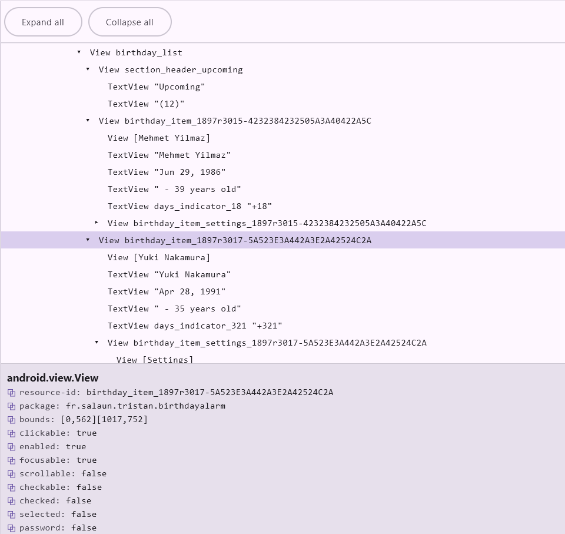

---

## 3. Le mode d'exploration manuelle

Accessible via **Manuel** dans la barre d'outils. Vous pilotez le device
**depuis l'application**, et chaque écran traversé est enregistré comme un
état d'une session (avec screenshot, dump et transitions) — comme
l'exploration automatique, mais c'est vous qui conduisez.

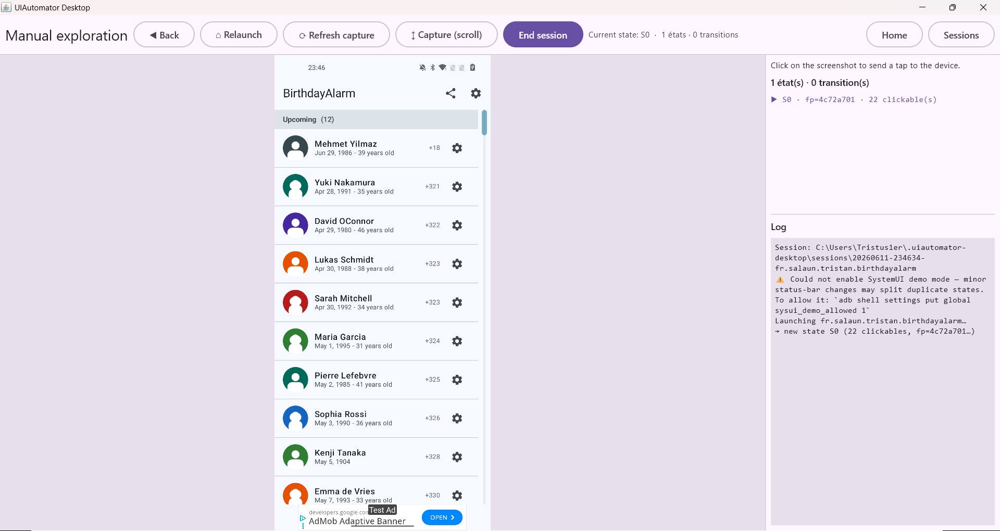

### Déroulé

1. Renseignez le package cible et cliquez sur **Démarrer** : l'écran courant
   du device est capturé et devient le premier état.
2. **Cliquez directement sur la capture** : le clic est converti en
   coordonnées device et un *tap* réel est envoyé. Le nouvel écran est
   capturé, enregistré (ou reconnu s'il est déjà connu) et la transition
   tracée.
3. Boutons de contrôle :
   - **◀ Retour** — envoie BACK au device ;
   - **⌂ Accueil** — relance l'application ;
   - **⟳ Actualiser** — recapture l'écran sans interagir ;
   - **↕ Capturer le scroll** — voir ci-dessous ;
   - **Terminer** — clôt la session manuelle (elle apparaît ensuite dans
     *Sessions* et dans le *Graphe*).

### La capture scrollée (stitching)

**↕ Capturer le scroll** fait défiler l'écran du device et **assemble les
frames en une seule image haute** (les bandeaux fixes — barre d'app, FAB,
footer collant — sont détectés et conservés à leur place). La barre
d'information indique le nombre de frames assemblées et la hauteur virtuelle.

Vous pouvez **cliquer n'importe où dans l'image assemblée**, y compris sur un
élément qui n'était pas visible à l'écran : l'application re-scrolle le device
à la bonne position et tape au bon endroit.

### Le panneau latéral

- La liste des **états enregistrés** (`S0`, `S1`, …) avec leur empreinte et
  leur nombre d'éléments cliquables ; l'état courant est marqué **▶**.
- Les **logs** de la session (sélectionnables / copiables).

---

## 4. Le mode d'exploration automatique

Accessible via **Explorer**. L'application lance l'app cible et la parcourt
seule, « comme un humain » : elle tape sur chaque élément, suit où il mène,
revient en arrière, et construit la carte complète des écrans (états) et des
transitions.

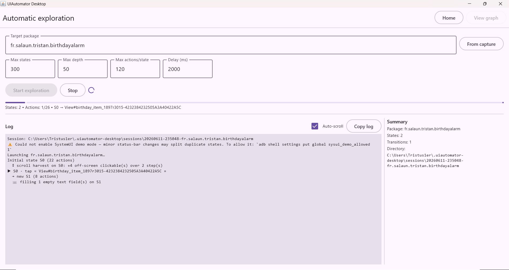


### 4.1 La configuration

| Champ | Rôle |
|---|---|
| **Package cible** | L'application à explorer. Le bouton **Depuis la capture** le pré-remplit avec le package de la dernière capture. |
| **Max d'états** | Plafond de sécurité sur le nombre d'écrans distincts (la déduplication arrête naturellement l'exploration bien avant dans la plupart des apps). |
| **Profondeur max** | Profondeur *de branchement* maximale. Les enchaînements linéaires (onboarding, wizard) ne la consomment pas — seuls les écrans qui offrent plusieurs chemins comptent. |
| **Actions par état** | Nombre maximal d'éléments exercés par écran. |
| **Délai d'attente (ms)** | Temps de stabilisation après chaque geste, en plus de la détection d'inactivité de l'écran. |

La section **Appareils** liste les téléphones connectés avec une case à
cocher chacun : cochez-en **plusieurs pour lancer l'exploration sur chacun en
parallèle**. Chaque appareil obtient sa propre session (le dossier est suffixé
du numéro de série) — idéal pour comparer ensuite le comportement de la même
app sur plusieurs téléphones, côte à côte, via les exports HTML ou l'écran
*Sessions*. Sans case cochée, l'exploration part sur l'appareil sélectionné
dans la barre d'outils, comme avant.

**Démarrer** lance l'exploration ; **Arrêter** interrompt proprement toutes
les exécutions en cours (les sessions partielles sont sauvegardées sur disque
et restent exploitables).

Pendant l'exploration, **un panneau de suivi par appareil** s'affiche côte à
côte : nom de l'appareil, barre de progression (`Découverts: X | Traités:
Y/Z`, état courant, action courante), compteurs d'états/transitions, dossier
de la session, et logs détaillés avec **Auto-scroll** et **Copier les logs**.

### 4.2 Ce que l'explorateur sait gérer tout seul

L'algorithme embarque de nombreuses heuristiques pour rester autonome quelle
que soit l'application :

- **Dialogues de permission système** : capturés comme états puis
  **auto-accordés** (le bouton le plus permissif est choisi, jamais
  « Refuser »), y compris les chaînes de plusieurs permissions et les détours
  par les Réglages système. Les dialogues d'activation Bluetooth/Localisation
  de Google Play Services sont traités de la même façon.
- **Crash et ANR** : un dialogue « l'application s'est arrêtée » est fermé et
  enregistré comme transition *crashed* (annotée avec l'extrait `FATAL
  EXCEPTION` du logcat) ; un « ne répond pas » reçoit d'abord « Attendre »
  (l'app récupère souvent). Un retour silencieux au launcher est attribué de
  la même manière.
- **Éléments destructifs** (déconnexion, suppression, achat, appel…) :
  par défaut ils sont **repérés mais jamais tapés** (transition `skipped`
  visible dans le graphe), pour qu'un « Se déconnecter » ne condamne pas le
  reste de l'exploration. Politique configurable : ignorer / exercer en
  dernier / capturer le dialogue de confirmation sans confirmer / tout taper.
- **Pickers à molette** (heure, date) : chaque cellule est repliée en une
  seule boucle, au lieu de générer 24 faux états.
- **Listes / grilles** : un seul représentant par groupe d'éléments
  identiques est exercé ; une sélection qui reste sur le même écran est
  reconnue comme telle.
- **Champs de saisie** : remplis automatiquement avec des valeurs plausibles
  (email, téléphone, mot de passe, code…), puis le clavier est refermé pour
  ne pas voler les taps suivants.
- **Contenu hors écran** : chaque écran est scrollé pour récolter les
  éléments invisibles au repos ; ils sont re-scrollés en vue avant d'être
  tapés. Au passage, les frames sont **assemblées en une capture scrollée
  complète** (le même stitching que « ↕ Capturer le scroll » du mode manuel),
  enregistrée avec l'état et consultable dans la fenêtre de détail du graphe.
- **Pagers horizontaux / onboardings « swipe-only »** : un balayage
  synthétique avance de page en page même sans bouton *Suivant*.
- **Appuis longs** : les éléments `long-clickable` reçoivent un appui long
  (menus contextuels invisibles au tap).
- **Écrans d'attente** (mise à jour firmware, téléchargement,
  « connexion… ») : patiemment attendus jusqu'à ce que l'app avance, avec un
  budget maximal, et jamais deux fois sur le même écran bloqué.
- **Sorties de l'application** (page web, dialer, partage…) : l'écran externe
  est capturé comme état terminal puis l'explorateur revient dans l'app.
- **Déduplication intelligente** : barre d'état figée (mode démo SystemUI),
  identité par conteneur racine, par Activity au premier plan, et par
  empreinte « chiffres masqués » (un compteur ou une horloge qui change ne
  crée pas de doublon).
- **Couverture du manifest** : en fin de parcours, l'application compare les
  activities déclarées (exportées) à celles réellement visitées, affiche un
  **taux de couverture**, et lance directement (`am start`) celles que l'UI
  n'a jamais atteintes pour les explorer aussi.
- **Récupération** : si l'explorateur se perd (drift, écran inconnu), il se
  re-ancre, rejoue le chemin d'origine, ou relance l'app ; les chemins
  enregistrés qui ne se reproduisent plus sont élagués.

Vous n'avez rien à faire pour bénéficier de tout cela — c'est le comportement
par défaut. Quand une app résiste (écran à séquence imposée, élément invisible
dans l'arbre d'accessibilité), passez aux **règles** ci-dessous.

---

## 5. Les règles personnalisées

Accessible via **Règles**. Les règles sont rangées **par package**, stockées
globalement (`~/.uiautomator-desktop/rules/`), et exportables / importables en
`.zip` pour être partagées.

Il existe **deux types de règles**, complémentaires :

### 5.1 Les règles d'écran (routines)

> « Quand tu reconnais CET écran, exécute CETTE séquence, et ne fais rien
> d'autre dessus. »

Idéal pour les écrans à séquence imposée : licence à accepter après un scroll
obligatoire, onboarding à étapes, activation Bluetooth…

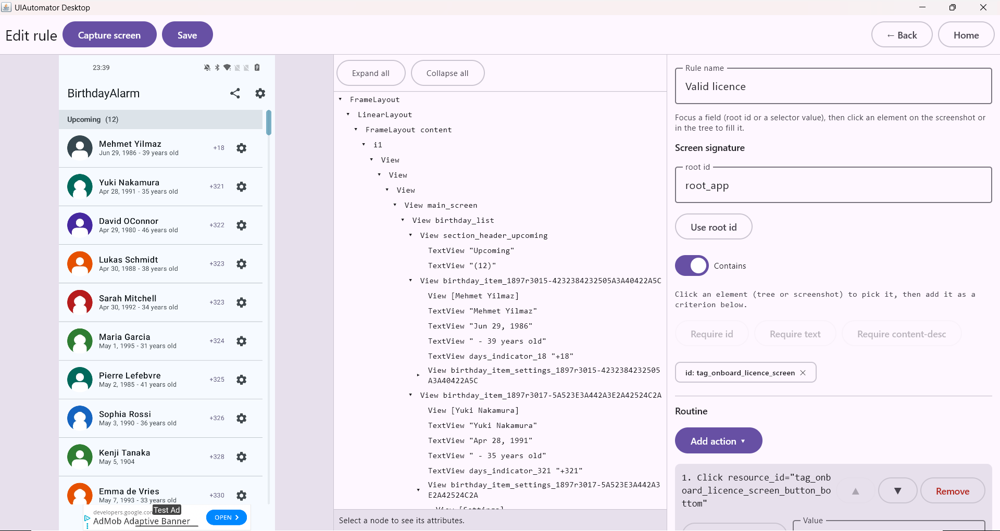

**Création** (bouton **Add screen rule** sur le paquet) :

1. **Capturer** : prend une capture de référence de l'écran concerné
   (screenshot + arbre), affichée dans les deux premières colonnes.
2. **Définir la signature** — ce qui identifie l'écran :
   - cliquez un élément sur la capture **ou double-cliquez** dans l'arbre pour
     le « sélectionner », puis utilisez **Ajouter resourceId / texte /
     contentDesc** pour en faire un critère ;
   - **Utiliser l'ID racine** remplit le champ *root id* avec le conteneur
     racine détecté ;
   - les critères apparaissent en *chips* (cliquer une chip la supprime) ;
   - tous les critères posés doivent être satisfaits (ET logique).
3. **Composer la routine** — la séquence d'actions : **Clic**, **Saisir
   texte**, **Scroll** (direction + montant : N éléments / % / pixels /
   jusqu'au bout), **Attendre**, **Retour**, **Capture** (enregistre l'écran
   intermédiaire — un dialogue transitoire, une permission — comme étape à
   part entière dans le graphe). Les actions se réordonnent (↑ / ↓) et se
   suppriment.
   *Astuce : quand le focus est dans un champ sélecteur (marqué •), cliquer un
   élément sur la capture remplit le champ automatiquement.*
4. **Enregistrer** (au moins un critère de signature + un nom requis).

Pendant l'exploration automatique, dès qu'un écran fraîchement atteint matche
la signature, la routine s'exécute **à la place** de l'exploration générique
de cet écran (passage strict), et chaque étape capturée apparaît comme un état
`RULE` dans le graphe. Les règles d'un paquet s'évaluent dans l'ordre de la
liste (réordonnables ▲ / ▼, activables / désactivables individuellement).

### 5.2 Les règles d'éléments

> « Si tu vois CET élément — où que ce soit — clique dessus / évite-le /
> balaye-le… et continue d'explorer le reste normalement. »

À la différence des règles d'écran, elles **ne remplacent pas** l'exploration :
elles ajoutent (ou retirent) une seule action ciblée.

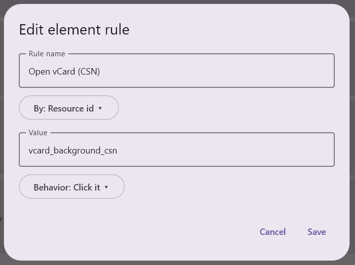

Sur l'écran d'un paquet, section **Règles d'éléments** → **Ajouter une règle
d'élément** :

- **Sélecteur** : par `resource-id`, `texte` ou `content-desc` (exact ou
  *contains*) ;
- **Comportement** :
  - **Cliquer dessus** — force un tap, *même si l'élément est marqué
    `clickable="false"`* dans l'arbre d'accessibilité (cas fréquent des
    surfaces Compose : l'image est interactive mais le flag n'est pas
    exposé) ;
  - **Appui long** ;
  - **Balayer dessus** (swipe horizontal) ;
  - **Éviter** — ne jamais y toucher (transition `skipped` dans le graphe).

Un comportement Cliquer / Appui long / Balayer est prioritaire sur toutes les
heuristiques (y compris le garde-fou destructif : la règle exprime votre choix
explicite). « Éviter » l'emporte sur tout.

---

## 6. Le graphe d'exploration

Accessible via **Graphe** dès qu'une session est chargée (après une
exploration, ou en ouvrant une session depuis *Sessions*). Chaque écran
découvert est une **carte** (screenshot miniature, identifiant `S0`/`S1`/…,
profondeur, nombre d'actions, package) ; les **flèches** sont les transitions.

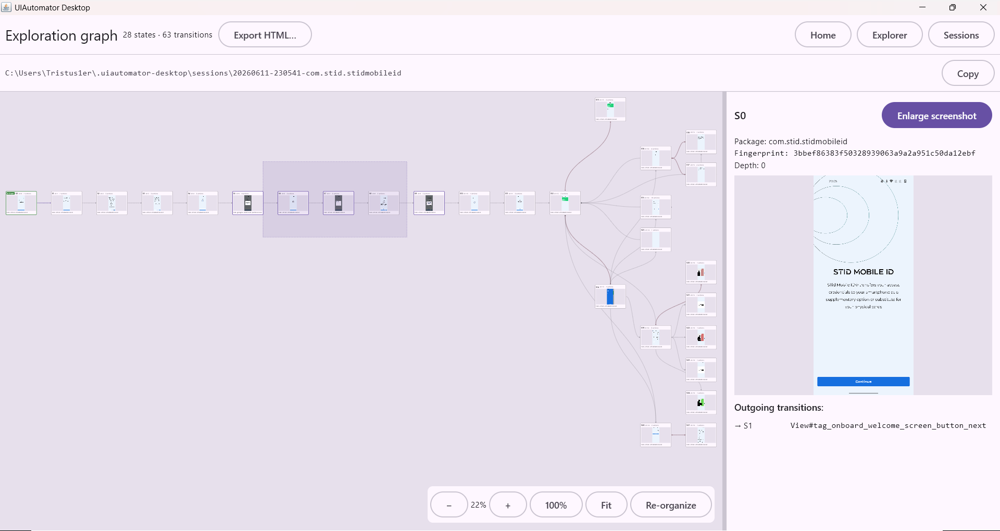

### 6.1 Naviguer dans le canvas

| Geste | Effet |
|---|---|
| Molette | Pan vertical |
| **Ctrl + molette** | Zoom (0,2× à 3×), centré sur le curseur |
| Drag sur le fond | Pan libre |
| Boutons **− / + / 100% / Fit** (coin bas-droit) | Zoom out / in, retour à 100 %, ajustement du graphe entier à la fenêtre |
| **Réorganiser** | Recalcule la disposition automatique (arbre rangé de gauche à droite, croisements minimisés) et oublie les positions manuelles |

### 6.2 Sélectionner et déplacer les cartes

| Geste | Effet |
|---|---|
| Clic sur une carte | Sélection simple |
| **Maj + clic** | Ajoute à la sélection |
| **Ctrl + clic** | Bascule (ajoute / retire) |
| **Maj + drag sur le fond** | Rectangle de sélection (pointillés) — toutes les cartes touchées sont ajoutées |
| Drag d'une carte sélectionnée | Déplace **tout le groupe** |
| **Double-clic sur une carte** | Ouvre la **fenêtre de détail** de la capture (voir 6.5) |
| **Ctrl+Z / Ctrl+Y** | Annuler / refaire les manipulations de disposition (10 niveaux) |

Pendant un déplacement, des **guides d'alignement magnétiques** apparaissent :
la carte s'aimante aux bords des cartes voisines.

Les positions manuelles sont **persistées avec la session** : vous retrouvez
votre mise en page en rouvrant la session.

### 6.3 Le menu contextuel (clic droit)

Avec une sélection active :

- **Alignements** (≥ 2 cartes) : en haut / axe horizontal / en bas, à gauche /
  axe vertical / à droite ; **Empiler en colonne / en ligne**.
- **Distribution** (≥ 3 cartes) : espacement égal horizontal / vertical.
- **Réinitialiser la position (auto-layout)** : la sélection reprend sa place
  calculée.
- **Fusionner N cartes** (≥ 2) : fusionne des états qui représentent en
  réalité le même écran — les transitions sont re-routées vers la carte
  conservée.
- **Supprimer** la ou les cartes (avec dialogue de confirmation listant les
  transitions affectées).

### 6.4 Lire les flèches

| Apparence | Signification |
|---|---|
| Grise | Transition normale (tap → autre écran) |
| Boucle ↺ | L'action reste sur le même écran (toggle, sélection de liste, picker) |
| Double pointe ↔ (couleur accent) | Aller-retour A↔B |
| **Rouge** | L'action a quitté l'application (`leftApp`) ou a échoué / fait crasher l'app |
| Bleue épaisse | Touche une carte sélectionnée |
| **Orange épaisse + halo** | Transition survolée dans le panneau de détails |

### 6.5 Le panneau de détails et la fenêtre de détail

Sélectionnez une carte : le panneau de droite affiche ses métadonnées
(package, fingerprint, profondeur), sa capture, et la liste de ses
**transitions sortantes** (`→ S12`, `↺ S3`, erreurs en rouge…).

- **Survoler une transition** dans la liste surligne la flèche en orange sur
  le canvas **et** encadre la zone exacte qui a été tapée sur la capture.
- **Agrandir la capture** (ou double-clic sur la carte) ouvre la **fenêtre de
  détail** : capture en grand + arbre XML complet de l'état, avec la case
  **Afficher les cliquables** qui surligne en bleu tous les éléments
  interactifs enregistrés. Cliquer un élément cliquable affiche sa
  destination (`→ S7`, boucle, erreur, sortie d'app, ou « pas encore
  testé ») avec un bouton **Open state** pour sauter à l'état cible.
- Pour un écran qui scrolle, la fenêtre s'ouvre sur la **Vue scrollée
  complète** : l'image assemblée de tout le contenu, défilable verticalement
  — la carte du graphe garde la capture simple. Décochez la case pour revenir
  à la vue interactive (survol, cliquables, destinations).

### 6.6 Export HTML

Le bouton **Exporter en HTML** produit une **page web autonome** (screenshots
inclus en base64) reprenant le graphe avec zoom, pan, sélection et panneau de
détails — consultable par n'importe qui dans un navigateur, sans installer
l'application. Idéal pour partager une cartographie d'app.

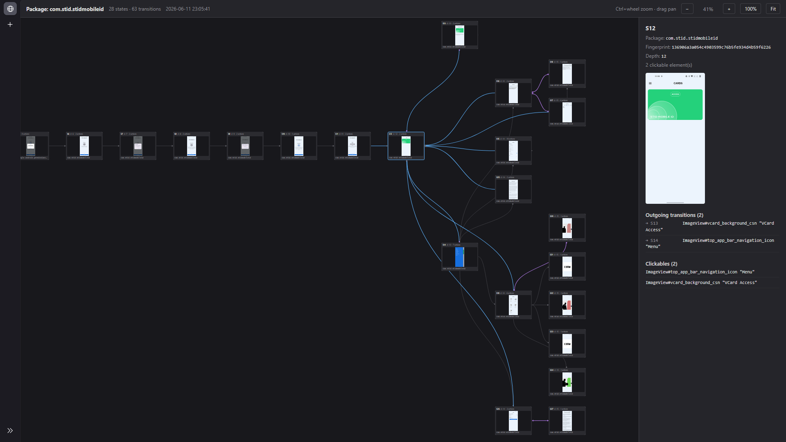

---

## 7. La gestion des sessions

Accessible via **Sessions**. Chaque exploration (automatique ou manuelle) crée
un dossier de session daté sous `~/.uiautomator-desktop/sessions/`
(`session.json` + un dossier `states/` avec les PNG et XML de chaque état).

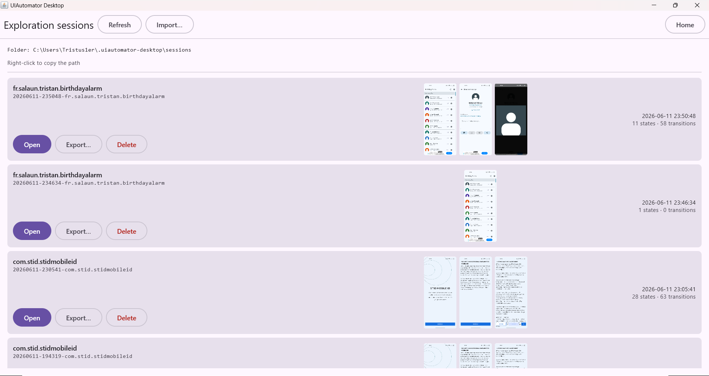


- Chaque ligne montre le **package exploré**, le **nom du dossier**, la date,
  le compte d'états / transitions, et un **aperçu des trois premiers écrans**
  (vignettes pleine hauteur, chargées paresseusement pour rester légères en
  mémoire).
- **Ouvrir** charge la session (le bouton *Graphe* apparaît alors dans la
  barre d'outils).
- **Exporter** crée un `.zip` portable de la session complète ; **Importer**
  (en haut) recharge un tel zip — et ouvre la session directement.
- **Supprimer** efface le dossier (confirmation demandée).
- Le **chemin du dossier des sessions** est affiché en haut : un **clic
  droit** dessus le copie dans le presse-papier (toast de confirmation), le
  texte est aussi sélectionnable.
- **Actualiser** re-scanne le dossier.

---

## 8. Les paramètres

Accessible via **Paramètres**.

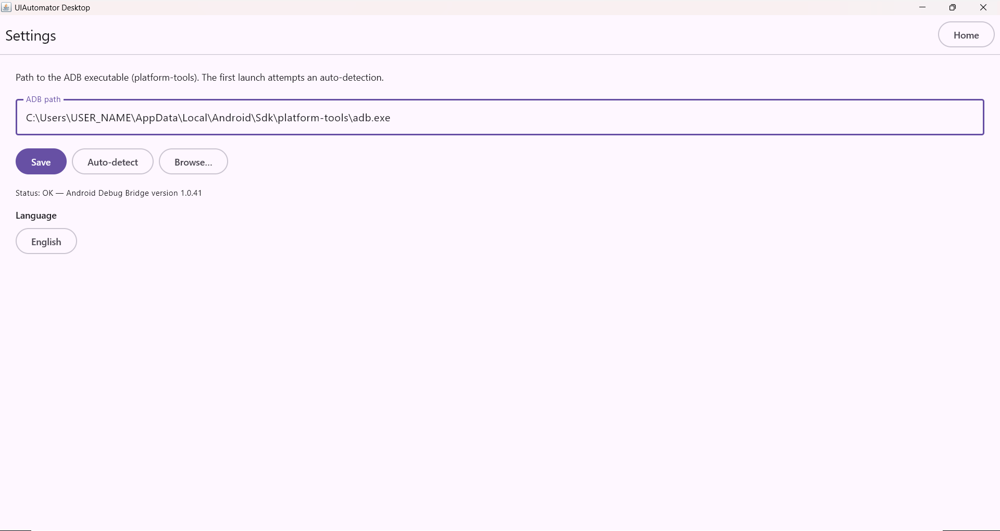

### Chemin ADB

- Champ **Chemin ADB** + **Enregistrer** : chemin de l'exécutable
  (`…\platform-tools\adb.exe`).
- **Autodétection** : relance la recherche automatique (variables
  d'environnement, emplacements SDK standards, `PATH`).
- **Parcourir…** : sélecteur de fichier natif.
- La ligne de statut confirme la validité (`OK — …` / `Échec : …`).

### Langue

Liste déroulante : **langue du système** (détectée automatiquement) ou choix
explicite parmi **English, Français, Español, Deutsch**. Le changement est
immédiat et mémorisé.

Toutes les préférences (chemin ADB, dernier device, langue, configuration
d'exploration) vivent dans `~/.uiautomator-desktop/config.properties`.

---

## 9. Astuces et raccourcis transverses

| Où | Geste | Effet |
|---|---|---|
| Capture / fenêtre détail | Survol | Surligne l'élément sous le curseur (rouge) des deux côtés |
| Capture / arbre | Clic | **Épingle** la sélection (le survol ne la change plus) |
| Arbre XML | Double-clic | Dépliage / repliage profond du sous-arbre |
| Arbre XML | `↑ ↓ → ←` | Navigation et expansion au clavier |
| Panneau détails du nœud | Clic sur ⧉ | Copie l'attribut (resource-id, bounds…) |
| Graphe | Double-clic carte | Fenêtre de détail de l'état |
| Graphe | Maj+drag / Maj+clic / Ctrl+clic | Sélection rectangle / additive / bascule |
| Graphe | Ctrl+molette · molette · drag fond | Zoom · pan vertical · pan libre |
| Graphe | Clic droit | Menu aligner / distribuer / fusionner / supprimer |
| Graphe | Ctrl+Z / Ctrl+Y | Annuler / refaire la disposition |
| Sessions | Clic droit sur le chemin | Copie le chemin du dossier |
| Éditeur de règle | Focus dans un champ • puis clic sur la capture | Remplit le champ avec l'élément cliqué |
| Partout | Textes monospace (chemins, fingerprints, logs) | Sélectionnables à la souris pour copie |

---

*Document généré pour la version courante de l'application ; les libellés
exacts dépendent de la langue choisie dans les Paramètres.*
